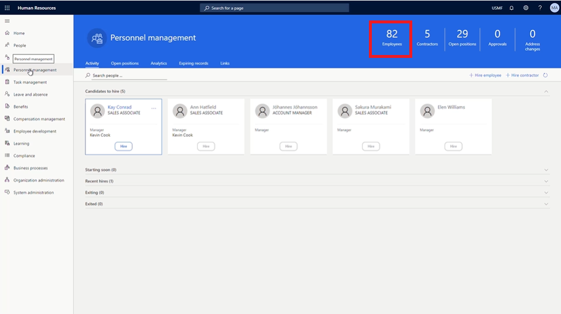

---
demo:
  title: '데모 1: 학습 과정 할당'
  module: 'Module 4: Learn the Fundamentals of Microsoft Dynamics 365 Human Resources'
---

## 데모 1 - 학습 과정 할당

1. **Microsoft Dynamics 365 Human Resources** 홈 페이지로 이동합니다.  
    인사 관리자는 Microsoft Dynamics 365 Human Resources에서 직원에게 교육 과정을 할당할 수 있습니다. 이 예에서는 회사 신입 사원인 Alicia에게 입사한 지 30일이 지나지 않은 직원에게 제공되는 교육을 할당해야 합니다.

1. 오른쪽 위의 회사 선택기에서 연결할 회사가 **USMF**인지 확인합니다. 회사가 **USMF**가 아니면 USMF로 변경합니다.

1. 화면 왼쪽 위에서 **인사 관리** 탭을 선택합니다.

1. **인사 관리** 페이지 오른쪽에서 **직원**이라는 단어 바로 위에 있는 번호를 클릭합니다.

    

1. **직원** 표에서 교육을 할당할 직원 이름을 선택합니다. **Alicia Thornber** 등을 선택할 수 있습니다.  
    다음으로 역량 및 개발 탭을 사용하여 직원의 인증, 학력, 기술 관련 정보로 이동하는 링크를 확인합니다.

1. 직원 페이지에서 **역량 및 개발** 탭을 선택합니다.

1. **역량** 섹션에서 **과정**을 선택합니다.  
    직원의 과정 페이지에서 할당된 과정이 있는지를 확인할 수 있습니다. Alicia의 경우에는 아무 과정도 표시되지 않습니다. 할당 가능한 과정을 확인하려면 과정 ID 메뉴를 선택해야 합니다.

1. **과정 ID** 메뉴를 선택합니다.

1. 과정 표에서 **과정 ID** 메뉴를 선택합니다.

1. **과정 ID** 메뉴에서 **과정 상태** 메뉴를 선택합니다.

1. **과정 상태** 메뉴에서 **정확한 과정 상태** 상자를 선택합니다.  
    그런 다음 적용할 **과정 ID** 필터를 편집해야 합니다. 예를 들어 개설된 과정만 표시되도록 필터를 변경해야 합니다.

1. **정확한 과정 상태** 상자에 **개설**을 입력합니다.

1. **과정 상태** 메뉴에서 **적용**을 선택하여 진행 가능한 개설 과정을 모두 표시합니다.  
    이제 Alicia에게 신입 사원 교육 과정을 할당할 수 있습니다.

1. 할당할 과정을 선택합니다. **00006 신입 사원 교육** 등을 선택할 수 이습니다.

1. 과정 데이터 전송 창에서 **예**를 선택합니다.

1. **과정** 페이지의 **시작 날짜** 열에서 **달력 아이콘**을 선택합니다.

1. 달력에서 시작 날짜를 선택합니다. **2021년 1월 5일** 등을 선택할 수 있습니다.

1. **종료 날짜** 열에서 **달력 아이콘**을 선택합니다.

1. 달력에서 교육 종료 날짜를 선택합니다. **2021년 1월 8일** 등을 선택할 수 있습니다.

1. **과정** 페이지 왼쪽에서 **저장**을 선택하여 변경 내용을 저장합니다.

1. **과정** 페이지 오른쪽에서 **X**를 선택하여 페이지를 닫습니다.  
    할당된 과정을 변경해야 하는 경우 과정을 다시 선택합니다.

1. **직원** 페이지의 **역량** 섹션에서 **과정**을 선택합니다.

1. **과정** 페이지의 탐색 모음에서 **편집**을 선택하여 필요한 사항을 변경합니다.

1. **시작 날짜** 열에서 **달력 아이콘**을 선택합니다.

1. 과정의 새 시작 날짜를 선택합니다. **2021년 1월 6일** 등을 선택할 수 있습니다.

1. **저장**을 선택합니다.

1. **X**를 선택하여 페이지를 닫습니다.

1. **직원** 페이지에서 **X**를 선택하여 페이지를 닫습니다.
