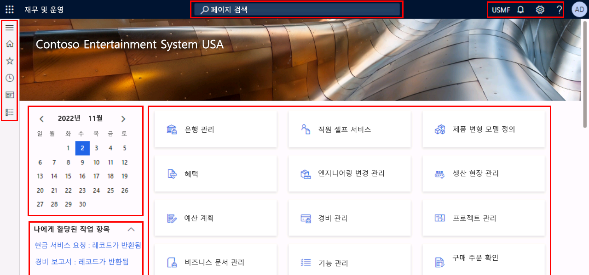
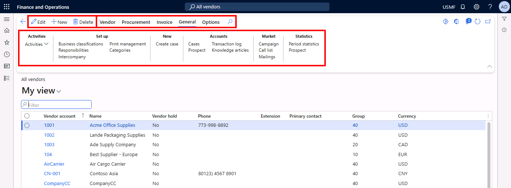

---
lab:
  title: '랩 1: Finance and Operations 앱 탐색'
  module: 'Module 1: Explore the core capabilities of Dynamics 365 finance and operations apps'
---

# 모듈 1: Dynamics 365 금융 및 운영 앱의 핵심 기능 살펴보기

## 랩 1: Finance and Operations 앱 탐색

## Objective

지금까지 Finance and Operations 앱을 살펴보았으므로 이제 앱의 인터페이스를 탐색해 보겠습니다.

## 랩 설정

- **예상 소요 시간:** 10분

## Instructions

### 랩 컴퓨터에 로그인

1.  아래 자격 증명을 사용하여 랩 컴퓨터에 로그인합니다.

    - 사용자 이름: `Administrator`

    - 암호: `pass@word1`

1.  계속하기 전에 관리 사용자 프로비저닝 스크립트가 완료될 때까지 기다립니다. 2~3분 정도 걸릴 수 있습니다. 스크립트가 완료되면 관리 사용자가 업데이트되었음을 확인하는 팝업 상자가 잠시 표시됩니다. 

1.  **Microsoft Edge** 는 Finance & Operations URL을 엽니다. <https://usnconeboxax1aos.cloud.onebox.dynamics.com>

1.  **리소스** 메뉴에 제공된 사용자 이름 및 암호를 사용하여 로그인합니다. 

### Finance and Operations 앱 탐색

1.  **재무 및 운영 홈**페이지에 다음이 표시됩니다. 

    -  왼쪽 탐색 메뉴(기본값으로 축소된 상태) 

    - 회사의 기본 배너 이미지입니다. 

    - 조직 내 역할에 따라 제공되는 작업 영역 타일 

    - 자신에게 할당된 일정 및 작업 항목 

    - 필요한 항목을 빠르게 찾는 데 매우 유용한 **페이지 모음을 검색** 합니다. 

    - 오른쪽 위에는 현재 작업 중인 회사, 알림, 설정, 도움말 링크가 표시됩니다. 

    

1.  표시된 회사가 **USMF**인지 확인합니다. 

1.  왼쪽 위에서 **탐색 창 확장** 햄버거 메뉴를 선택합니다. 

1.  탐색 창에는 **즐겨찾기**, **최근 항목**, **작업 영역** 및 **모듈**용 컬렉션이 있습니다. 

1.  탐색 창에서 **모듈** > **시스템 관리**를 선택합니다. 

1.  **시스템 관리** 모듈에서 사용할 수 있는 다양한 영역을 **검토**합니다. 

1.  **설정** 아래에서 **클라이언트 성능 옵션**을 선택합니다. 

1.  클라이언트 성능 옵션 창의 **기능 설명 사용** 아래에서 토글 스위치를 선택하고 **예**로 설정합니다. 

1.  사용 가능한 다른 옵션을 검토하고 창 아래쪽으로 스크롤한 다음 **확인을** 선택합니다. 

1.  홈 페이지의 오른쪽 위에서 **설정** 아이콘을 선택한 다음 **사용자 옵션을** 선택합니다. 

    

1.  **사용자 옵션** 페이지에서 탭을 사용하여 계정에 적용되는 다양한 설정을 구성합니다. 

1.  **기본 설정** 탭을 선택합니다. 

1.  사용 가능한 기본 설정을 검토합니다. 로그인할 때 표시되는 기본 **회사** 및 **초기 페이지를** 변경할 수 있습니다. 

1.  **계정** 및 **워크플로** 탭을 선택하여 검토합니다. 

1.  왼쪽 탐색 메뉴에서 **홈** 아이콘을 선택합니다. 

1.  홈 페이지 위쪽 가운데에서 **페이지 검색** 상자를 선택합니다. 

1.  검색 상자에서 를 검색합니다. `All vendors` 

1.  페이지를 처음 검색할 때는 다소 기다려야 할 수도 있습니다. 검색이 처리되는 동안에는 검색 상자 오른쪽에 회전하는 작은 원이 표시됩니다. 

1.  첫 번째 결과 **모든 공급업체를** 선택합니다. 이는 **모듈** > **계정 지불** > **공급업체****모든 공급업체** > 로 이동한 것과 같습니다. 

1.  **모든 공급업체** 페이지는 목록 페이지의 예입니다. 목록 페이지에는 대개 읽기, 작성, 삭제, 업데이트가 가능한 마스터 데이터가 포함됩니다. 목록 위의 작업 창을 사용하여 사용할 수 있는 추가 함수가 표시됩니다. 

    

1.  목록에서 공급업체 중 하나를 강조 표시하고 오른쪽에서 **관련 정보** FactBox 창을 선택하고 제공된 추가 정보를 검토합니다. 

1.  공급업체 목록에서 **Acme Office Supplies 레코드를** 엽니다. 

1.  작업 창에서 **편집** 을 선택한 다음 **그룹** 필드에서 드롭다운 메뉴를 선택한 다음 **공급업체 그룹** 열 제목을 선택합니다. 

    

1.  많은 메뉴에서 **정렬** 및 **필터링을** 사용할 수 있습니다. 필터를 사용하면 원하는 필드 내용을 빠르게 찾을 수 있습니다. 값을 이미 알고 있는 경우 드롭다운 메뉴를 사용하는 대신 필드에 입력하면 됩니다. 

1.  작업 창 오른쪽에서 추가 기능을 확인합니다. 각 항목을 마우스로 가리키고 기능 설명서를 검토합니다. 

1.  **닫기** 아이콘을 선택하여 이 레코드를 닫고 **모든 공급업체** 목록 페이지로 돌아갑니다. 

    

1.  오른쪽 위에서 ?**** 물음표 아이콘을 선택한 다음 **도움말**을 선택합니다. 

1.  도움말 정보 창에 현재 페이지의 콘텐츠가 표시됩니다. 도움말 창을 **닫**습니다. 

1.  왼쪽 상단의 **재무 및 운영** 단추를 사용하여 **기본 dashboard** 반환하거나 왼쪽 탐색 메뉴의 **홈** 아이콘으로 돌아갑니다. 

    > **참고:** 바로 가기 키: Alt+Shift+Home. Dynamics 365 Finance 및 Operations는 시스템에 액세스하는 속도를 높이기 위해 다음과 같은 많은 바로 가기 키를 지원합니다.https://learn.microsoft.com/en-us/dynamics365/fin-ops-core/fin-ops/get-started/shortcut-keys

1.  **작업 영역 타일**을 선택한 다음 해당 작업 영역에 대한 도움말 정보를 검토합니다. 완료되면 기본 대시보드로 돌아갑니다. 

