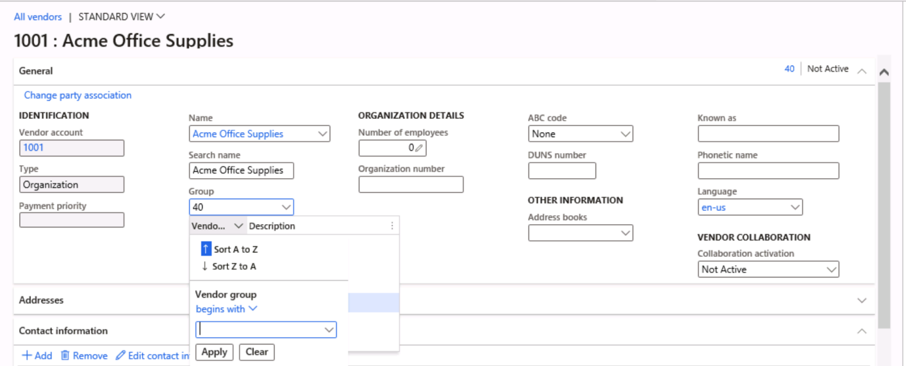

---
lab:
  title: '랩 1: 재무 및 운영 앱 탐색'
  module: 'Module 1: Explore the core capabilities of Dynamics 365 finance and operations apps'
---

# 모듈 1: Dynamics 365 금융 및 운영 앱의 핵심 기능 살펴보기

## 랩 1: 재무 및 운영 앱 탐색

## Objective

이제 재무 및 운영 앱에 익숙해졌으므로 인터페이스를 탐색하는 데 시간이 좀 걸릴 수 있습니다.

## 랩 설정

- **예상 소요 시간:** 10분

## Instructions

### 랩 컴퓨터에 로그인

1.  아래 자격 증명을 사용하여 랩 컴퓨터에 로그인합니다.

    - 사용자 이름: `Administrator`

    - 암호: `pass@word1`

1.  계속하기 전에 관리 사용자 프로비저닝 스크립트가 완료될 때까지 기다립니다. 이 작업은 2-3분 정도 걸릴 수 있습니다. 스크립트가 완료되면 관리 사용자가 업데이트되었음을 확인하는 팝업 상자가 잠시 표시됩니다. 

1.  **Microsoft Edge** 는 Finance & Operations URL을 엽니다. <https://usnconeboxax1aos.cloud.onebox.dynamics.com> 

1.  **리소스** 메뉴에 제공된 사용자 이름 및 암호를 사용하여 로그인합니다. 

### Finance and Operations 앱 탐색

이제 재무 및 운영 앱에 익숙해졌으므로 인터페이스를 탐색하는 데 시간이 좀 걸릴 수 있습니다.

1.  **재무 및 운영 홈**페이지에서 구성된 경우 다음을 찾습니다.

    - 기본적으로 축소된 왼쪽의 탐색 메뉴입니다.

    - 회사의 로고입니다.

    - 조직의 역할에 따라 사용할 수 있는 작업 영역 타일입니다.

    - 사용자에게 할당된 일정 및 작업 항목입니다.

    - 필요한 정보를 빠르게 찾는데 유용한 검색 창

    - 오른쪽 위에는 현재 작업 중인 회사, 알림, 설정 및 도움말 링크가 있습니다. 나열된 회사가 USMF**인지 **확인합니다.

    

2.  왼쪽 위에서 **탐색 창 확장** 햄버거 메뉴를 선택합니다.

3.  탐색 창에서 즐겨찾기 **, 최근** 항목 **, **작업 영역** 및 **모듈에 대한 **컬렉션을 찾을 수 있습니다**.

4.  탐색 창에서 **모듈** > **시스템 관리**를 선택합니다.

5.  시스템 관리 모듈에서 사용할 수 있는 영역을 검토합니다.

6.  설치에서 **** 클라이언트 성능 옵션을** 선택합니다**.

7.  클라이언트 성능 옵션 창의 **기능 설명선이 사용하도록 설정된** 상태에서 **토글 스위치를 선택하고 예**로 **설정되어 있는지 확인**합니다.

8.  사용 가능한 다른 옵션을 검토하고 창 아래쪽으로 스크롤한 다음 확인을** 선택합니다**.

9.  **홈**페이지 오른쪽 위에서 **설정** 아이콘을 선택하고 **사용자 옵션**을 선택합니다.

    

10. **옵션** 페이지에서 탭을 사용하여 계정에 적용되는 다양한 설정을 구성합니다.

11. 기본 설정** 탭을 **선택합니다.

12. 사용 가능한 기본 설정을 검토합니다. 로그인할 때 기본 회사 및 초기 페이지 보기를 변경할 수 있습니다.

13. 계정** **및 워크플로** 탭을 **선택하고 검토합니다.

14. 왼쪽 탐색 메뉴에서 홈** 아이콘을 **선택합니다.

15. **홈**페이지 위쪽 가운데에서 **페이지 검색** 상자를 선택합니다.

16. 검색 상자에서 모든 공급업체를 **검색합니다**.

17. 모든 공급업체** 계정 지불 > 공급업체 선택 **

18. 페이지를 처음 검색할 때 기다려야 할 수 있습니다. 검색이 처리되는 동안 검색 상자 오른쪽에 작은 회전 원이 있습니다.

19. **모든 공급업체** 페이지는 목록 페이지의 예입니다. 목록 페이지에는 읽기, 만들기, 삭제, 업데이트가 가능한 마스터 데이터가 포함됩니다. 목록 위에 리본을 사용하는 기능이 더 있습니다.

    

20. 목록에서 공급업체 중 하나를 강조 표시하고 오른쪽에서 관련 정보** 메뉴를 선택하고 **제공된 추가 정보를 검토합니다.

21. 공급업체 목록에서 Acme Office Supplies를** 선택합니다**.

22. **그룹** 메뉴를 선택한 다음 공급업체 그룹** 열 제목을 **선택합니다.

    

23. 많은 메뉴에서 정렬 및 필터링을 사용할 수 있습니다. 필터를 사용하여 원하는 필드 콘텐츠를 빠르게 찾습니다.

24. 오른쪽 위에서 추가 기능을 확인합니다. 각 항목으로 마우스를 이동하고 기능 설명선 검토 검토를 완료한 후 **닫기** 아이콘을 선택하여 페이지를 닫고 **홈**페이지로 돌아옵니다.

    

25. 오른쪽 위에서 도움말 물음표 아이콘을 **선택한 다음 도움말을 선택합니다****.**

26. 도움말 정보는 현재 페이지와 관련이 있습니다.

27. 작업 영역 타일을 선택한 다음 해당 작업 영역에 대한 도움말 정보를 검토합니다. 검토를 완료한 후 **홈**페이지로 돌아옵니다.

