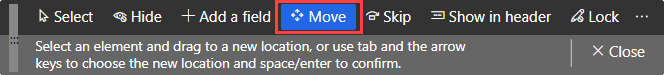

---
lab:
  title: '랩 2: 작업 영역 및 필터링 살펴보기'
  module: 'Module 1: Learn the Fundamentals of Microsoft Dynamics 365 Supply Chain Management'
ms.openlocfilehash: 0a2815e312b9798dcf93ec6cee669eb65a1f9942
ms.sourcegitcommit: 252458fca8e71b6e5e8b99ae4c2b47cd85461a30
ms.translationtype: HT
ms.contentlocale: ko-KR
ms.lasthandoff: 01/27/2022
ms.locfileid: "137909925"
---
# 모듈 1: Microsoft Dynamics 365 Supply Chain Management의 기본 사항 파악

## 랩 2 - 작업 영역 및 필터링 기능 살펴보기

## 목표

Finance and Operations에 처음 로그인하면 대다수 기본 제공 작업 영역을 사용할 수 있습니다. 충족해야 할 수 있는 요구 관련 콘텐츠로 작업 영역을 직접 만들 수도 있습니다. 작업 영역은 Dynamics 365의 여러 기능 중 하나입니다. 그러나 확인해야 하는 특정 항목을 정확하게 찾으려면 필터링을 사용해야 합니다. 즉, 새 개인 설정 작업 영역을 만들고 필터링을 사용해 필요한 각 항목을 확인해야 합니다.

## 랩 설정

   - **예상 소요 시간:** 10분

## Instructions

1. Finance and Operations 홈 페이지의 작업 영역 타일 오른쪽에서 빈 영역을 마우스 오른쪽 단추로 클릭하거나 길게 눌러 메뉴를 트리거합니다.

    

1. 메뉴에서 **개인 설정: TilePageContainer** 를 선택합니다.

1. 개인 설정 창에서 **+ 작업 영역 추가** 를 선택합니다.

1. 작은 개인 설정 창이 표시되지 않으면 홈페이지에서 위쪽으로 스크롤한 다음 마우스 오른쪽 단추를 클릭하거나 길게 누르고 **개인 설정: TilePageContainer** 를 다시 선택합니다.

    

1. 홈 페이지에서 아래쪽으로 스크롤하여 새 **내 작업 영역 1** 타일을 찾습니다.

    

1. 타일을 마우스 오른쪽 단추로 클릭하거나 길게 누르고 **개인 설정: 내 작업 영역 1** 을 선택합니다.

1. 개인 설정 창에서 내 작업 영역 1의 이름을 **내 작업 영역** 으로 바꾸고 **이 페이지 사용자 설정** 을 선택합니다.  
    변경된 이름이 자동 저장됩니다.

1. 새로 열린 도구 모음에서 **이동** 을 선택합니다.

    

1. **내 작업 영역** 타일을 선택하여 홈 페이지의 다른 위치로 이동합니다.

    >[!Note] 타일을 이동할 수 없으면 페이지를 새로 고친 후 위의 단계를 다시 시도하여 타일을 이동합니다.

1. 도구 모음을 닫습니다.

1. 홈 페이지의 **이 페이지 검색** 상자를 사용하여 **모든 공급업체** 를 검색한 후에 선택합니다.

1. 모든 공급업체 페이지 상단 메뉴에서 **옵션** > **작업 영역에 추가** 를 선택합니다.

1. **작업 영역** 필터 상자에 **내 작업 영역** 을 입력하고 작업 영역을 선택합니다.

1. 표시 메뉴를 선택하고 사용 가능한 옵션을 검토한 후에 **타일** 을 선택합니다.

1. 선택을 완료한 후 **구성** 을 선택합니다.

1. 타일로 추가 창에서 타일 이름을 확인하고 **확인** 을 선택합니다.

1. 왼쪽 탐색 창에서 **홈** 아이콘을 선택합니다.

1. 홈 페이지에서 새 작업 영역을 선택합니다.

1. 내 작업 영역 페이지에서 새로 추가한 공급업체 타일이 표시되는지 확인합니다.

1. **공급업체** 타일을 선택합니다.

1. 모든 공급업체 페이지의 **필터** 상자에 **Contoso** 를 입력합니다.

1. Contoso를 찾는 데 사용할 수 있는 여러 필드를 검토합니다.

    

1. **이름: "Contoso"** 를 선택하고 필터 결과를 확인합니다.

1. 필터 상자의 내용을 지우고 Enter 키를 눌러 모든 공급업체를 표시합니다.

1. **그룹** 열 제목을 선택합니다.

    

1. 이 열을 사용하면 그룹을 오름차순(A->Z로 정렬) 또는 내림차순(Z->A로 정렬)으로 정렬할 수 있습니다.

1. **그룹** 아래에서 **다음으로 시작** 메뉴를 선택하고 비교 연산자를 검토합니다. **정확하게 일치함** 을 선택합니다.

1. **정확하게 일치함** 아래의 메뉴를 선택하고 **다른 공급업체** 를 선택합니다.  
    메뉴 필드에 값을 입력할 수도 있습니다.

1. **적용** 을 선택하고 결과를 검토합니다. 그룹 열 머리글에는 필터 아이콘이 있습니다.

    

1. **그룹** 열를 선택하고 필터 메뉴에서 **지우기** 를 선택합니다.

1. 모든 공급업체 제목 왼쪽에서 필터 아이콘을 선택합니다.

    

1. 필터 창의 오른쪽 위에서 **+ 추가** 를 선택합니다.

1. 필터 필드 추가 창에서 **그룹** 왼쪽의 체크박스를 선택하고 업데이트를 선택합니다.

1. 필터가 더 추가되었습니다. 따라서 여러 기준에 따라 목록을 필터링할 수 있습니다.

    

1. **공급업체 계정 시작 문자** 필터에서 메뉴를 선택하고 **Northwind Traders** 를 선택합니다.

1. **그룹 시작 문자** 필터에서 메뉴를 선택하고 **30** 을 선택합니다.

1. **적용** 을 선택하고 필터 결과를 검토합니다.

1. 필터 창에서 **다시 설정** 을 선택합니다. 그러면 추가 필터가 제거되며 기본 필터가 빈 값으로 다시 설정됩니다.

1. 리본 표시줄에서 **옵션** 을 선택하고 페이지 옵션 섹션에서 **고급 필터 또는 정렬** 을 선택합니다.

    

1. 조회 - 공급업체 창에서 **+ 추가** 를 선택합니다.

1. 새 행의 필드 셀에서 메뉴를 선택하고 **그룹** 을 선택합니다.

1. 메뉴를 선택하고 그룹 이름 입력을 시작한 다음 필터 결과에서 그룹을 선택할 수도 있습니다.

1. 기준 셀에서 **열기** 아이콘을 선택합니다.

    

1. 공급업체 그룹 목록에서 **30 다른 공급업체** 를 선택합니다.

1. 새 쿼리를 저장하려면 **쿼리 선택** 아래에서 **수정** 메뉴를 선택하고 **다른 이름으로 저장** 을 선택합니다.

    

1. 쿼리 저장 창의 **이름** 상자에 내 쿼리를 입력하고 **확인** 을 선택합니다.

1. 조회 - 공급업체 페이지에서 **확인** 을 선택합니다.

1. 목록에 새로 만든 쿼리의 결과가 반영됩니다.

1. 필터를 제거하려면 **고급 필터 또는 정렬** 을 선택한 후 조회 - 공급업체 페이지에서 **다시 설정**, **확인** 을 차례로 선택합니다.

1. 그러면 쿼리가 다시 설정됩니다. 그러나 저장한 쿼리가 삭제되지는 않습니다.
