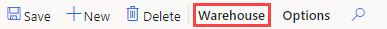

---
lab:
  title: '랩 5: 창고 만들기'
  module: 'Module 1: Learn the Fundamentals of Microsoft Dynamics 365 Supply Chain Management'
ms.openlocfilehash: 919ea602b0768683acd845dd184b3bf5a0364fd0
ms.sourcegitcommit: 252458fca8e71b6e5e8b99ae4c2b47cd85461a30
ms.translationtype: HT
ms.contentlocale: ko-KR
ms.lasthandoff: 01/27/2022
ms.locfileid: "137909760"
---
# 모듈 1: Microsoft Dynamics 365 Supply Chain Management의 기본 사항 파악

## 랩 5 - 창고 만들기

## 목표
Supply Chain Management의 창고 관리 시스템을 사용하면 계속해서 변화하는 요구에 맞게 창고 레이아웃을 유동적으로 정의할 수 있으므로 창고를 가장 효율적인 방식으로 활용할 수 있습니다.

- 저장 영역의 우선 순위를 각기 다르게 설정하면 상품을 최적 위치에 배치할 수 있습니다.
- 그리고 온도 요구 사항, 품목의 다양한 회전율 등의 여러 가지 저장 요구에 맞게 창고를 여러 구역으로 구분할 수 있습니다.
- 어떤 수준에서나 창고 위치를 지정할 수 있습니다(예: 현장, 창고, 통로, 랙, 선반, 저장함 위치).
- 이러한 위치는 실제 용량 제약 조건 설정을 사용하여 그룹화할 수 있습니다.
- 그리고 쿼리 정의 규칙을 기준으로 품목 저장 및 선택 방법을 제어할 수 있습니다.

Supply Chain Management에서 창고 관리 기능을 사용하려면 창고를 만든 후 고급 또는 특수 창고 관리 활동을 수행할 수 있도록 설정해야 합니다.

## 랩 설정

   - **예상 소요 시간:** 10분

## Instructions

1. Finance and Operations 홈 페이지 오른쪽 위에서 작업을 수행할 회사가 USMF인지 확인합니다.

1. 필요한 경우 회사를 선택하고 메뉴에서 **USMF** 를 선택합니다.

1. 왼쪽 탐색 창에서 **모듈** > **재고 관리** > **설정** > **재고 내역** > **창고** 를 선택합니다.

    

1. 창고 페이지 상단 메뉴에서 **새로 만들기** 를 선택합니다.

1. **창고** 필드에 **101** 을 입력합니다.

1. **이름** 필드에 **초과 물량 보관 창고** 를 입력합니다.

1. **현장** 메뉴를 선택하고 **3 가정용 폼 생산** 을 선택합니다.

1. **위치 이름** 을 확장합니다.  
    이 섹션의 옵션을 사용하여 위치 이름의 기본 형식을 정의합니다.

1. **통로 포함** 및 **랙 포함** 옵션을 **예** 로 설정합니다.

1. 랙의 **형식** 상자에 값을 입력합니다.  
    예를 들어 랙 위치 이름 형식에 OVFL이 포함되어야 한다면 형식 상자에 해당 값을 입력합니다.

1. **수준** 아래에서 **선반 포함** 옵션을 **예** 로 설정합니다.

1. 선반의 **형식** 필드에 **-##** 을 입력합니다.

1. 상단 메뉴에서 **창고** 를 선택합니다.

    

1. **유지 관리** 아래에서 **위치** 마법사를 선택합니다.

1. 시작 페이지에서 정보를 검토하고 오른쪽 아래에서 **다음** 을 선택합니다.

1. **발신 도크** 및 **대량 위치** 체크박스 선택을 취소합니다.

1. **다음** 을 선택하고 정보를 검토합니다.

1. 각 페이지를 검토하고 다음 페이지로 계속 넘어갑니다. 페이지 검토가 완료되면 **마침** 을 선택합니다.

1. 페이지를 닫고 홈 페이지로 돌아옵니다.
