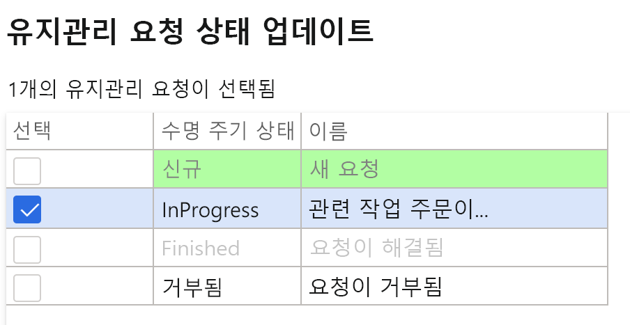
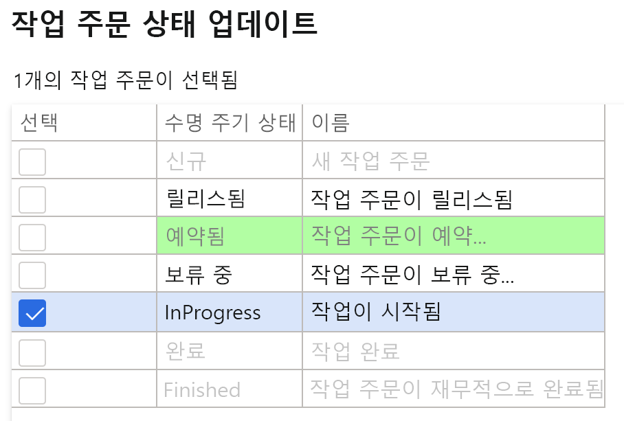
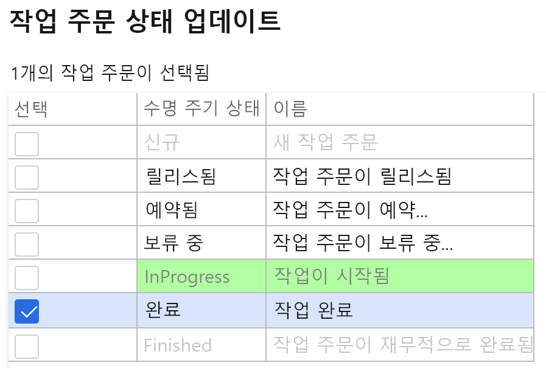

---
lab:
    title: '랩 7: 유지 관리 작업 주문 만들기'
    module: '모듈 1: Microsoft Dynamics 365 Supply Chain Management의 기본 사항 파악'
---

## 랩 7 - 유지 관리 작업 주문 만들기

**목표**

시스템에서 생성된 유지 관리 주문은 자산에 대해 수행해야 하는 유지 관리나 수리에 대한 설명을 제공합니다. 이러한 유지 관리 주문을 사용하여 유지 관리 요청을 완료하는 데 적합한 리소스를 할당합니다. 작업 주문을 만들 때는 할당된 리소스를 통해 실행되는 유지 관리 주문을 토대로 활용합니다.

**랩 설정**

예상 시간: 15분

**지침**

1. Finance and Operations 홈 페이지 오른쪽 위에서 작업을 수행할 회사가 USMF인지 확인합니다.

2. 필요한 경우 회사를 선택하고 메뉴에서 **USMF**를 선택합니다.

3. 왼쪽 탐색 창에서 **모듈** **&gt; 자산 관리 &gt; 설정 &gt; 유지 관리 요청 &gt; 수명 주기 상태**를 선택합니다.

4. 진행 중을 선택하고 작업 창에서 **편집** 단추를 클릭합니다.

5. **일반** 탭 아래에서 **작업 주문 만들기** 값을 예로 변경합니다.

6. 왼쪽 탐색 창에서 **모듈** **&gt; 자산 관리 &gt; 작업 영역 &gt; 유지 관리 요청 관리**를 선택합니다.

7. **유지 관리 요청 만들기**를 클릭합니다.

8. 대화 상자의 필드에 다음 값을 입력하고 **확인** 단추를 클릭합니다.

	- 유지 관리 요청 유형: 수정

	- 설명: 금속 탐지기의 잡음

	- 기능 위치: PP-02-02

	- 자산: MD-201

	- 서비스 수준: 4

	- 결함 증상: 과도한 잡음

	- 결함 영역: 전기 

9. **유지 관리 요청** 양식을 닫고 **유지 관리 요청 관리** 작업 영역으로 돌아갑니다.

10. 화면 오른쪽 위 모서리에 있는 **새로 고침** 아이콘을 눌러 페이지를 새로 고칩니다.

11. 새 유지 관리 요청이 작업 주문 없이 유지 관리 요청 목록에 표시됩니다.

12. 새로 만들어진 유지 관리 요청을 선택하고 **유지 관리 요청 상태 업데이트** 단추를 클릭합니다. 

13. 대화 상자에서 진행 중 옆에 있는 체크박스를 선택하고 **확인**을 클릭합니다.

 

14. 새로 만들어진 유지 관리 요청을 선택하고 **작업 주문 만들기** 단추를 클릭합니다. 

15. 대화 상자의 필드에 다음 값을 입력하고 **확인** 단추를 클릭합니다.

	- 유지 관리 작업 유형: 검사

16. 새 작업 주문이 만들어지고, 선택한 유지 관리 요청 레코드에서 작업 주문이 업데이트됩니다.

17. 작업 주문을 클릭하고 **작업 주문 세부 정보** 화면으로 이동합니다.

18. 작업 주문 라인 아래에서 **디스패치** 단추를 클릭합니다.

19. 대화 상자의 필드에 다음 값을 입력하고 **확인** 단추를 클릭합니다.

	- 작업자: Ted Howard

20. 작업 메뉴에서 **작업 주문 &gt; 수명 주기 상태 &gt; 작업 주문 상태 업데이트**로 이동합니다.

21. 대화 상자에서 진행 중 옆에 있는 체크박스를 선택하고 **확인**을 클릭합니다.

22. 대화 상자에서 **실제 시작** 날짜 및 시간을 선택하고 **확인**을 클릭합니다.

23. 작업 주문 작업 메뉴에서 **작업 주문 &gt; 수명 주기 상태 &gt; 작업 주문 상태 업데이트**로 다시 이동합니다.

24. 대화 상자에서 완료됨 옆에 있는 체크박스를 선택하고 **확인**을 클릭합니다.

25. **실제 종료** 필드에서 시작 날짜 및 시간보다 이후의 날짜 및 시간을 선택하고 확인을 클릭합니다

26. 작업 주문 머리글의 현재 수명 주기 상태가 완료됨으로 표시됩니다.
