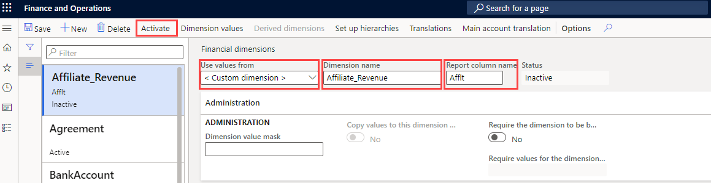

---
lab:
  title: '랩 1: 재무 차원 만들기'
  module: 'Module 2: Learn the Fundamentals of Microsoft Dynamics 365 Finance'
ms.openlocfilehash: 9bbc1a92cb719b988ddfa6a08e1e3b2d8c69976e
ms.sourcegitcommit: 252458fca8e71b6e5e8b99ae4c2b47cd85461a30
ms.translationtype: HT
ms.contentlocale: ko-KR
ms.lasthandoff: 01/27/2022
ms.locfileid: "137910028"
---
## 랩 1 - 재무 차원 만들기

## 목표

재무 차원 페이지에서는 계정 차트용 거래처 세그먼트로 사용할 수 있는 재무 차원을 만들 수 있습니다. 재무 차원에는 사용자 지정 차원과 엔터티 지원 차원의 두 가지 유형이 있습니다. 사용자 지정 차원은 여러 법인에서 공유할 수 있는 차원입니다. 이 차원의 값은 사용자가 입력 및 유지 관리합니다. 엔터티 지원 차원의 값은 고객 또는 매장 엔터티 등 시스템의 다른 위치에서 정의됩니다. 여러 법인에서 공유할 수 있는 엔터티 지원 차원도 있고 개별 회사별로만 사용 가능한 엔터티 지원 차원도 있습니다.

이 랩에서는 회사에서 사용할 사용자 지정 재무 차원을 만들어야 합니다.

## 랩 설정

   - **예상 소요 시간:** 5분

## Instructions

1. Finance and Operations 홈 페이지 오른쪽 위에서 작업을 수행할 회사가 USMF인지 확인합니다.

1. 필요한 경우 회사를 선택하고 메뉴에서 **USMF** 를 선택합니다.

1. 왼쪽 탐색 창에서 **모듈** > **총계정원장** > **계정 차트** > **차원** > **재무 차원** 을 선택합니다.

1. 상단 메뉴에서 **+ 새로 만들기** 를 선택합니다.

1. 재무 차원 페이지의 **다음 위치의 값 사용** 메뉴를 선택하고 **< 사용자 지정 차원 >** 을 선택합니다.

1. **차원 이름** 상자에 **Affliate_Revenue** 를 입력합니다.

1. **보고서 열 이름** 상자에 **Afflt** 를 입력합니다.

1. 상단 메뉴에서 **활성화** 를 선택합니다.

    

1. 대화 상자의 정보를 검토하고 **닫기** 를 선택합니다.

1. 경고 알림 배너를 검토합니다.

    

    >[!NOTE] 샌드박스 및 프로덕션 환경의 LCS(라이프사이클 서비스)를 통해 유지 관리 모드를 직접 설정 및 해제할 수 있습니다. 수명 주기 서비스 관리에 대한 자세한 내용은 [https://docs.microsoft.com/en-us/dynamics365/fin-ops-core/dev-itpro/deployment/maintenanceoperationsguide-newinfrastructure](https://docs.microsoft.com/en-us/dynamics365/fin-ops-core/dev-itpro/deployment/maintenanceoperationsguide-newinfrastructure)에서 확인할 수 있습니다.
