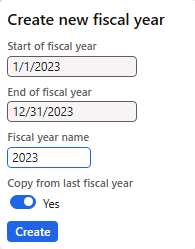

---
lab:
  title: '랩 1: 기본 계정 만들기'
  module: 'Module 2: Learn the Fundamentals of Microsoft Dynamics 365 Finance'
---

# 모듈 2: Microsoft Dynamics 365 Finance의 기본 사항 알아보기

## 랩 1: 기본 계정 만들기

## 랩 설정

   - **예상 시간**: 5분

## 지침

1.  재무 및 운영 홈페이지의 **오른쪽 위에 있는 USMF** 회사와 함께 **작업하고 있는지 확인**합니다.

2.  필요한 경우 회사를 선택하고 메뉴에서 **USMF**를 선택합니다.
3.  왼쪽 탐색 창에서 회계 달력**을 > 일정에 > 모듈 > 일반 원장을 선택합니다**.
4.  일정 **회계 선택**
5.  현재 연도가 이미 만들어진 경우 회계 달력 페이지를 종료 **합니다** .
6. 현재 연도가 만들어지지 않은 경우 작업 창에서 새해** 단추를 선택하고 **다음 스크린샷에 표시된 대로 현재 연도를 입력합니다. **만들기 단추를** 선택하여 현재 연도 달력을 만듭니다.

4.  왼쪽 탐색 창에서 **모듈** > **총계정원장** > **계정 차트** > **계정** > **주 계정**을 선택합니다.

5.  작업 창에서 + 새로** 만들기를 선택합니다**.

6.  기본 계정** 페이지에서 다음 값을 **입력합니다.

    - 주 계정: **601510**

    - 이름: **국제 통화 비용**

    - 주 계정 유형: **비용**

    - 주 계정 범주: **TANDEEXP**

    - DB/CR 기본값: **직불**

    

7.  **모듈 &gt; 일반 원장 &gt; 저널 항목 &gt; 일반 저널로 이동합니다.**

8.  작업 창에서 + 새로** 만들기를 선택합니다**.

9.  일반 저널 페이지에 다음 값을 **입력하고 작업 창에서 줄을** 선택합니다**.**

    - 이름: GenJrn

10.  저널 바우처** 페이지에 다음 값을 **입력합니다.

    - 계정 유형: **원장**

    - 주 계정: **601510**

    - 직불: **10.00** 

    - 오프셋 계정 유형: **원장**

    - 오프셋 계정 번호: **110180** 

11. **작업 창에서 저장** 단추를 선택합니다.

12. 게시** 시뮬레이트 유효성 &gt; 검사를 선택합니다**. 

13. **작업 창에서 게시** 단추를 선택합니다. 저널은 게시되어야 합니다.
