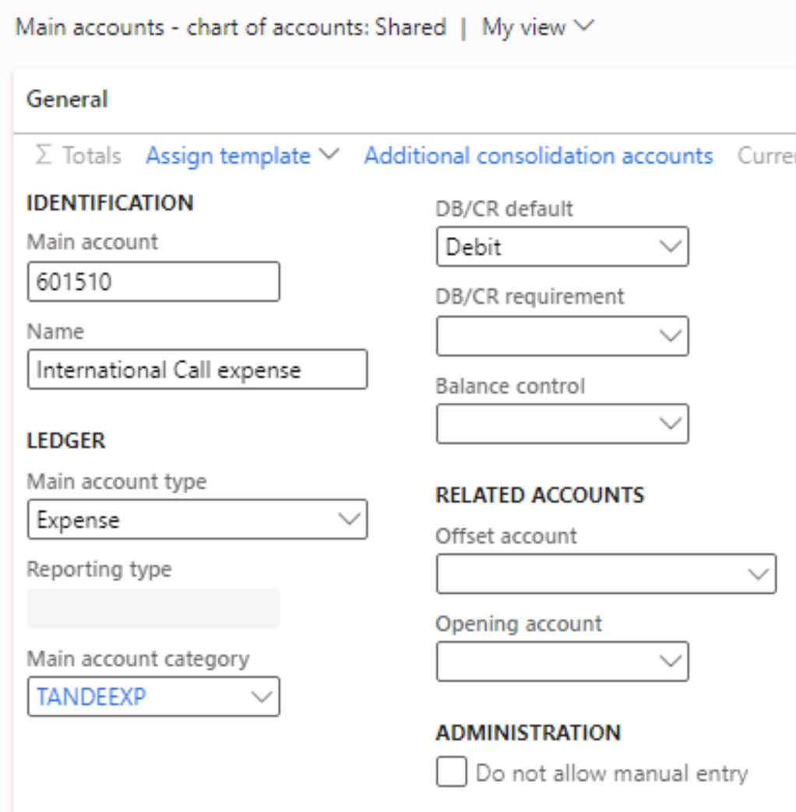

---
lab:
  title: '랩 1: 기본 계정 만들기'
  module: 'Module 2: Learn the Fundamentals of Microsoft Dynamics 365 Finance'
ms.openlocfilehash: 6568afcb26212ab952a48dfaf7bb4f377e4ffd36
ms.sourcegitcommit: aa74c0578c7018838f0c935f5901e9c667ef0801
ms.translationtype: HT
ms.contentlocale: ko-KR
ms.lasthandoff: 07/14/2022
ms.locfileid: "147116654"
---
# 모듈 2: Microsoft Dynamics 365 Finance의 기본 사항 파악
    
## 랩 1 - 기본 계정 만들기

## 지침

1. **Finance and Operations 홈** 페이지 오른쪽 위에서 작업을 수행할 회사가 USMF인지 확인합니다.

2. 필요한 경우 회사를 선택하고 메뉴에서 **USMF** 를 선택합니다.

3. 왼쪽 탐색 창에서 **모듈** > **총계정원장** > **계정 차트** > **계정** > **주 계정** 을 선택합니다.

4. 상단 메뉴에서 **+ 새로 만들기** 를 선택합니다.

5. 주 계정 페이지에 다음 값을 입력합니다.

    - 주 계정: **601510**

    - 이름: **국제 통화 비용**

    - 기본 경비 유형: **Expense**

    - 주 계정 유형: **TANDEEXP**

    - DB/CR 기본값: **차변**

 
