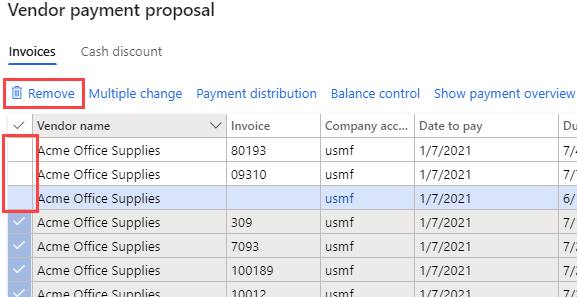

---
lab:
    title: '랩 2: 공급업체 결제 분개장 만들기'
    module: '모듈 2: Microsoft Dynamics 365 Finance의 기본 사항 파악'
---

## 랩 2 - 공급업체 결제 분개장 만들기

## 목표

공급업체에 정기적으로 대금을 결제하는 조직은 이제 공급업체 결제 제안서 생성 프로세스를 자동화할 수 있습니다. 공급업체 결제 제안서 자동화 기능은 다음 세부 정보를 정의합니다.

- 결제 제안서 실행 시기
- 결제해야 하는 송장 선택 시 사용할 기준
- 결제해야 하는 금액이 저장되는 공급업체 결제 분개장

결제 제안서 자동화 과정에서 결제 금액이 자동 게시되지는 않습니다. 그러므로 현재 사용 중인 유효성 검사 및 워크플로 프로세스를 계속 사용하여 작성된 결제 건을 승인할 수 있습니다.

이 랩에서는 새 공급업체 결제 분개장 기입 및 결제 제안서를 만듭니다.

## 랩 설정

   - **소요 시간**: 10분

## 지침

1. Finance and Operations 홈 페이지 오른쪽 위에서 작업을 수행할 회사가 USMF인지 확인합니다.

1. 필요한 경우 회사를 선택하고 메뉴에서 **USMF**를 선택합니다.

1. 왼쪽 탐색 창에서 **모듈** > **지급 계정** > **결제** > **공급업체 결제 분개장**을 선택합니다.

1. 상단 메뉴에서 **+ 새로 만들기**를 선택합니다.

1. 생성된 새 분개장 일괄 처리 번호를 확인합니다.

1. **이름** 상자에 **Vend**를 입력하고 필터링된 목록에서 **VendPay**를 선택합니다.

1. 상단 메뉴에서 **라인**을 선택합니다.

1. 공급업체 결제 페이지 상단 메뉴에서 **결제 제안서** > **결제 제안서 만들기**를 선택합니다.  
    결제 제안서는 결제용 송장을 선택하는 데 사용되는 쿼리입니다. 송장 목록을 편집하여 공급업체 결제 건을 만들거나 생성하기 전에 결제를 진행할 수 있습니다.

    

1. 공급업체 결제 제안서 창의 **송장 선택 기준**에서 **송장 선택 기준** 메뉴를 선택하고 사용 가능한 옵션을 검토한 후에 **기한**을 선택합니다.

1. **시작 날짜** 및 **종료 날짜**에서 기존 값을 삭제합니다. 이 연습에서는 이러한 날짜 범위를 비워 둡니다.

    >[!참고] 최소 결제 날짜를 결제 날짜로 사용할 수 있습니다. 최소 결제 날짜는 결제 건 작성 시에 사용하는 가장 빠른 날짜입니다. 예를 들어 송장의 기한이 최소 결제 날짜 이후이면 기한은 최소 결제 날짜가 아닌 결제 날짜로 설정됩니다. 즉, 결제 가능한 가장 늦은 날짜에 송장 금액을 결제할 수 있습니다.

1. **포함할 레코드**를 확장하여 옵션을 검토합니다.  
    결제 대상으로 선택하는 송장 범위를 공급업체 그룹 또는 결제 방법을 기준으로 제한하려는 경우에는 대개 필터를 사용합니다. 예를 들어 이번 결제 회차에는 송장 금액을 수표로만 결제하는 필터를 추가할 수 있습니다.

1. **고급 매개 변수**를 확장하여 사용 가능한 옵션을 검토합니다.  
    고급 매개 변수를 사용하면 결제 통화를 정의하거나 이번 결제 회차에서 중앙 결제 방식을 사용하도록 설정할 수 있습니다.

1. **확인**을 선택합니다.  
    확인을 선택하면 쿼리 결과가 표시됩니다. 결제하기로 선택한 송장 목록을 미리 보지 않으려는 경우 매개 변수 빠른 탭으로 돌아가서 **송장을 미리 보지 않고 결제 생성** 설정을 **예**로 변경하면 됩니다.

1. 공급업체 결제 제안서 창에서 **결제 개요 표시**를 선택하여 선택한 송장의 공급업체를 대상으로 작성할 결제 건을 확인합니다.

    

1. 메뉴에서 **결제 개요 숨기기**를 선택하여 결제 건을 숨깁니다.

1. **공급업체 이름** 열 제목 왼쪽의 확인 표시 아이콘을 선택하여 모든 송장을 선택합니다.

    

1. 처음 3개 송장의 체크박스 선택을 취소하고 메뉴에서 **제거**를 선택하여 다른 송장을 모두 제거합니다.

    

1. 대화 상자에서 **예**를 선택합니다.

1. 나머지 3개 송장을 검토합니다.

1. 송장 목록을 Excel로 내보내려면 표를 마우스 오른쪽 단추로 클릭하고 내보내기 옵션을 선택합니다.

1. 오른쪽 아래에서 **결제 만들기**를 선택하여 결제 분개장에서 공급업체 결제를 만듭니다.

1. 공급업체 결제 목록을 검토합니다.
