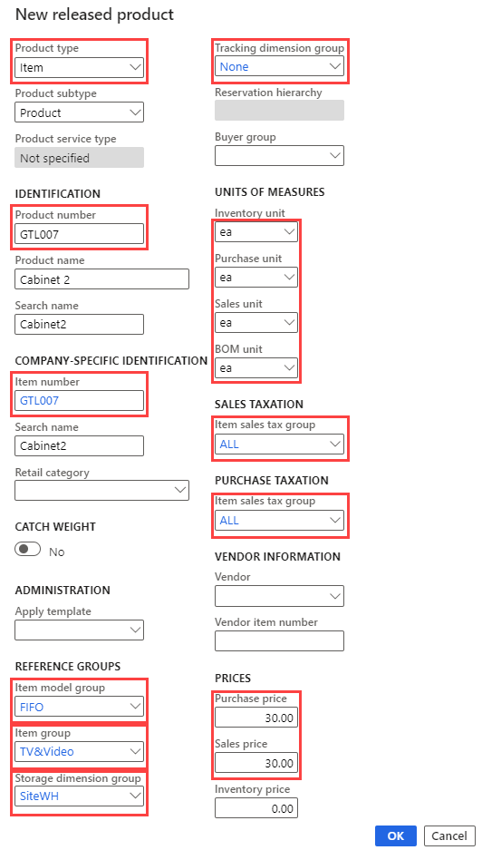

---
lab:
  title: '랩 1: 새 제품 만들기'
  module: 'Module 3: Learn the Fundamentals of Microsoft Dynamics 365 Supply Chain Management'
---

# 모듈 3: Microsoft Dynamics 365 Supply Chain Management의 기본 사항 파악

## 랩 1 - 새 제품 만들기

## 목표

Contoso Entertainment System USA(USMF)에서는 공급업체에서 구매할 새로 구성된 캐비닛용으로 신규 품목을 만들어야 합니다.

## 랩 설정

   - **예상 소요 시간:** 10분

## Instructions

1. Finance and Operations 홈 페이지 오른쪽 위에서 작업을 수행할 회사가 USMF인지 확인합니다.

1. 필요한 경우 회사를 선택하고 메뉴에서 **USMF**를 선택합니다.

1. 왼쪽 위에서 **탐색 창 확장** 햄버거 메뉴를 선택합니다.

1. 탐색 창에서 **모듈** > **제품 정보 관리**를 선택하고 **제품** 범주 아래에서 **출시된 제품**을 선택합니다.

1. 출시된 제품 세부 정보 페이지의 상단 메뉴에서  **+ 새로 만들기**를 선택합니다.

1. 새로 출시된 제품 창의  **제품 유형** 메뉴에서 **품목**이 선택되어 있는지 확인합니다.

1.  **제품 하위 유형** 메뉴에서 **제품**이 선택되어 있는지 확인합니다.

1.  **추적 차원 그룹** 메뉴를 선택한 다음  **없음**을 선택합니다.

1. **확인**의  **제품 번호** 및 **품목 번호** 상자에  **GTL007**을 입력합니다.

1.  **제품 이름** 박스에,  **캐비닛 2**를 입력합니다.

1. **참조 그룹**에서  **품목 모델 그룹** 메뉴를 선택한 다음  **FIFO 선입 선출**을 선택합니다.

1.  **품목 그룹** 메뉴를 선택한 다음 **TV 및 비디오**를 선택합니다.

1.  **저장 차원 그룹** 메뉴를 선택한 다음  **SiteWH**를 선택합니다.

1. **측정 단위**에서 다음 값이 설정되어 있는지 확인합니다.

    | **설정**| **값**|
    | :--- | :--- |
    | 재고 단위| 낱개|
    | 구매 단위| 낱개|
    | 판매 단위| 낱개|
    | BOM 단위| 낱개|

1. **매출세**에서 **품목 매출세 그룹** 메뉴를 선택한 다음  **모두**를 선택합니다.

1. **구매세**에서 **품목 매출세 그룹** 메뉴를 선택한 다음  **모두**를 선택합니다.

1. 가격의 구매 가격 상자에 30.00을 입력합니다.

1. 판매 가격 상자에 30.00을 입력합니다.

1. 신규 출시 제품은 다음과 같습니다.

    

1.  **확인**을 선택합니다.

1. 제품을 완성하려면 리본 표시줄의 **유지 관리**에서 **유효성 검사**를 선택합니다.

    

1. 모든 필수 필드 값의 유효성을 검사했음을 확인하는 정보 배너가 표시되는지 확인합니다.

    

1. 모든 페이지를 닫고 홈 페이지로 돌아옵니다.
