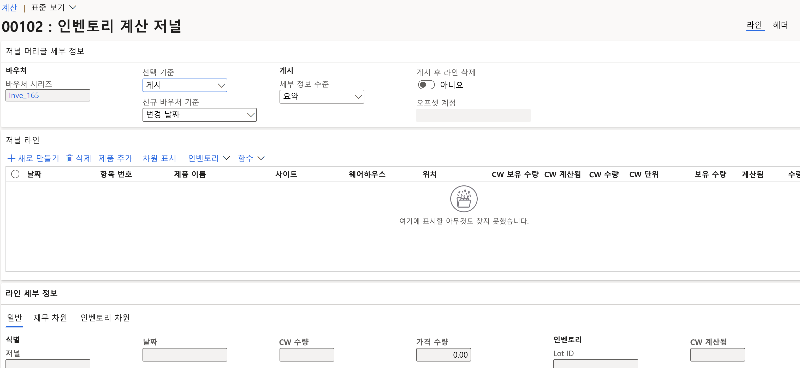

---
lab:
  title: '랩 3: 계산 저널 만들기'
  module: 'Module 3: Learn the Fundamentals of Microsoft Dynamics 365 Supply Chain Management'
---

# 모듈 3: Microsoft Dynamics 365 공급망 관리의 기본 사항 알아보기

## 랩 3: 계산 저널 만들기

## 랩 설정

   - **예상 소요 시간:** 10분

## Instructions

1.  재무 및 운영 홈페이지의 **오른쪽 위에 있는 USMF** 회사와 함께 **작업하고 있는지 확인**합니다. 필요한 경우 회사를 선택하고 드롭다운에서 USMF**를 선택합니다**. 

2.  왼쪽 탐색 창의 인벤토리 관리 모듈에서 **저널 항목** > **항목 계산 계산 > ****** 을 선택합니다.**** 

3.  작업 창에서 **+ 새로** 만들기 단추를 선택합니다. **인벤토리 저널** 만들기 대화 상자 창이 나타납니다. **시작** 단추를 선택합니다. 

4.  인벤토리 계산 저널** 양식은 **머리글 및 줄 정보와 함께 표시됩니다. 

    

5.  작업 창에서 선 만들기를&gt;** 선택합니다**. 

6.  **직접 계산 저널** 만들기 대화 상자 창에서 웨어하우스 **, **인벤토리 상태**, **위치** 및 **번호판** 필드를 예**로 **설정합니다**. 

    

7.  레코드를 **확장하여 섹션을 포함하고** 필터** 단추를 선택합니다**. 항목 번호 필드의 **경우 조건** 필드에 입력 **`A0001` 하고 확인을** 선택합니다**.** 

8.  직접 계산 저널** 만들기 대화 상자 창 아래쪽**에서 확인을** 선택합니다**. 

    항목 **A0001**의 현재 수량은 사이트, 웨어하우스 및 위치가 분리된 저널 라인** 그리드에 표시됩니다**. 

9.  **업무 일지 줄** 섹션의 **Counted** 열에서 각 사이트/웨어하우스 및 위치에 대해 계산된 숫자와 일치합니다. 다음을 참고하십시오. 

    - **보유** 수량이 **계산** 수량과 같으면 **수량** 필드는 비어 있습니다. 

    - **계산** 필드의 값이 **보유량** 필드보다 큰 경우 **수량** 필드에 양수 값이 포함됩니다. 

    - **계산** 필드의 값이 **보유량** 필드보다 작은 경우 **수량** 필드에 음수 값이 포함됩니다. 

10. 각 줄의 날짜** 필드 연도를 **2022년으로 변경합니다. 

11. **작업 창에서 유효성** 검사 단추를 선택하고 대화 상자 창에서 확인을** 선택합니다**. 

12. **게시** 단추를 선택합니다. 

13. **페이지를 닫** 고 홈페이지로 돌아갑니다. 

