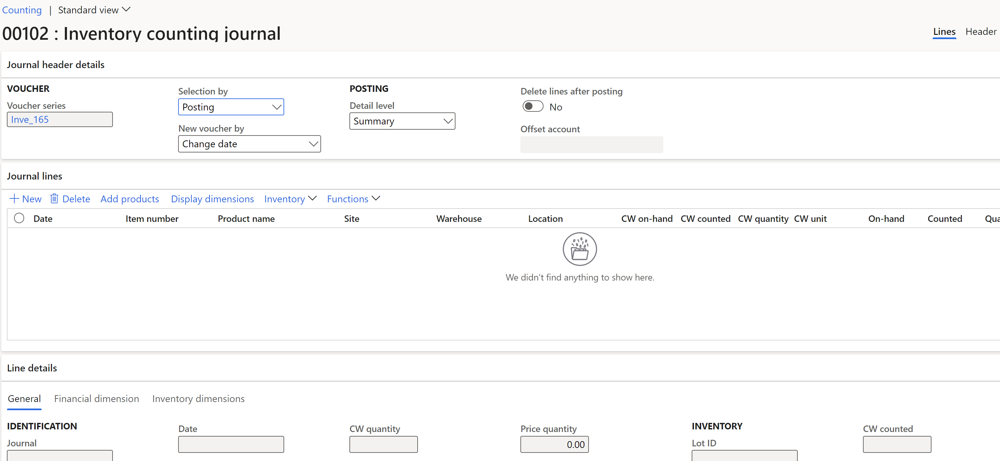

---
lab:
  title: '랩 3: 계산 분개장 만들기'
  module: 'Module 3: Learn the Fundamentals of Microsoft Dynamics 365 Supply Chain Management'
---

# 모듈 3: Microsoft Dynamics 365 Supply Chain Management의 기본 사항 파악

## 랩 3 - 회계 분개장 만들기

1. On the Finance and Operations home page, in the top right, verify you are working with the <bpt id="p1">**</bpt>USMF<ept id="p1">**</ept> company. If necessary, select the company, and from the drop down, select <bpt id="p1">**</bpt>USMF<ept id="p1">**</ept>.

2. 왼쪽 탐색 창에서 **모듈** > **재고 관리** > **분개장 항목** > **항목 계산** > **계산**을 선택합니다.

3. Select the <bpt id="p1">**</bpt>+New<ept id="p1">**</ept> button in the action pane. The <bpt id="p1">**</bpt>Create inventory journal<ept id="p1">**</ept> dialog form will appear with the <bpt id="p2">**</bpt>OK<ept id="p2">**</ept> button in the bottom. Select the <bpt id="p1">**</bpt>OK<ept id="p1">**</ept> button.

4. 머리글 및 세부 정보와 함께 재고 계산 분개장 양식이 표시됩니다.

5. 작업 창에서 **줄 만들기 -&gt; 온라인**을 선택합니다.

6. **보유량 계산 분개장 만들기** 대화 상자 창에서 **창고**, **재고 상태**, 위치 및 **번호판** 필드를 **예**로 설정합니다. 

7. Expand the <bpt id="p1">**</bpt>Record to include<ept id="p1">**</ept> section and select the <bpt id="p2">**</bpt>Filter<ept id="p2">**</ept> link. In the <bpt id="p1">**</bpt>Item number<ept id="p1">**</ept> field, select <bpt id="p2">**</bpt>A0001<ept id="p2">**</ept>, and then select <bpt id="p3">**</bpt>OK<ept id="p3">**</ept>.

8. **보유량 계산 분개장 만들기** 대화 상자 양식의 맨 아래에서 **확인**을 선택합니다.

항목 A0001의 보유 수량은 사이트, 창고, 위치 및 번호판이 분리된 **분개장 줄** 섹션에 표시됩니다.

9. In the <bpt id="p1">**</bpt>Counted<ept id="p1">**</ept> column of the <bpt id="p2">**</bpt>Journal line<ept id="p2">**</ept> section, enter the numbers counted in each Site/Warehouse/Location/License plate. Note the following:

    - **보유** 수량이 **계산** 수량과 같으면 **수량** 필드는 비어 있습니다.

    - **계산** 필드의 값이 **보유량** 필드보다 큰 경우 **수량** 필드에 양수 값이 포함됩니다.

    - **계산** 필드의 값이 **보유량** 필드보다 작은 경우 **수량** 필드에 음수 값이 포함됩니다.

10. 작업 창에서 **유효성 검사** 단추를 선택한 다음 **게시** 단추를 선택합니다.

11. 페이지를 닫고 홈페이지로 돌아옵니다.
